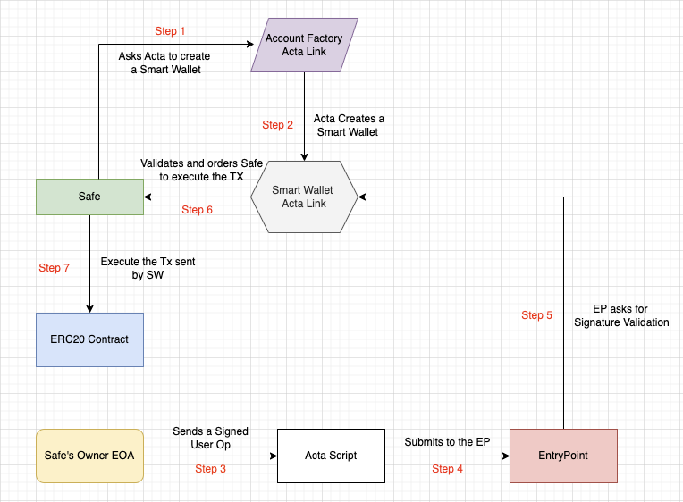

# Safe Smart Wallet

This project aims to create a smart wallet from a Safe Contract and process transactions using ERC-4337 flow.

## Features

- Smart Wallet creation from Safe's Address
- Smart Wallet acts as a module to the Safe
- Gasless Transactions as supported by the Paymaster

## Components

### Account Factory

The AF is responsible for dpeloying new Smart Wallets using CREATE2. If the account is alrady deployed, the `createAccount` function will simply return the address.

### Smart Wallets

The SW has 2 main functionalities, one is to validate the `UserOp` and the second is to command the Safe Contract to execute a transaction by calling `execTransactionFromModule`. For now, any one of the Safe's Owner can sign the `UserOp` and it shall pass.

### Paymaster

The Paymster helps to execute Gasless Transactions. For now, we are not validating signature, the paymaster is generous and pays the gas fees for every transaction.

## Flow

